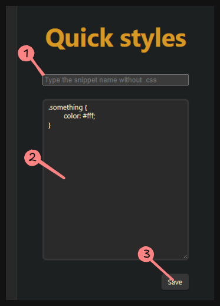

# Quick Styles
>
>[!caution]
> This plugin in beta test. Use this plugin in your vault on your own risk or backup notes first.
>
## Description

This plugin provides creating and managing snippets in your vault.

## How to use it?

1. Type the snippet name. You can type any snippet, even if it exists.
2. Write styles (Open css documentation in another window)
3. Save it. It will append after exists styles (If this snippet existed before)
